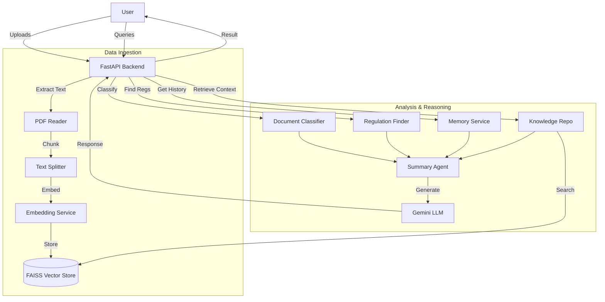

# HarveyLex AI Agent Workflow & Functionality

## 1. System Overview
HarveyLex is an AI-powered legal compliance assistant designed to analyze legal documents, identify risks, and answer user queries with precise citations. It leverages Google's Gemini models for reasoning and FAISS for semantic search/retrieval-augmented generation (RAG).

## 2. Core Architecture

The system is built on a modular architecture comprising several specialized AI agents and data services:

### **AI Modules**
*   **`SummaryAgent`**: The primary reasoning engine. It uses Gemini Pro/Flash to generate summaries, answer legal queries, and synthesize findings from retrieved context.
*   **`RegulationFinder`**: A retrieval agent that searches the vector store for relevant legal clauses and regulations based on semantic similarity.
*   **`DocumentClassifier`**: Determines the type of document (e.g., "Legal Agreement", "Non-Legal") to route it to the appropriate analysis pipeline.
*   **`ComplianceEngine`**: (Planned/In-Progress) Checks documents against specific regulatory frameworks.

### **Data Services**
*   **`KnowledgeRepository`**: The central interface for data access. It manages the `VectorStore` (FAISS) for semantic search and stores raw document text/metadata.
*   **`MemoryService`**: Manages conversational history, allowing the AI to maintain context across multiple turns of a chat session.
*   **`IngestionService`**: Handles file parsing (PDF/Text), chunking, and embedding generation.

## 3. Workflows

### A. Document Ingestion Workflow
*Goal: Transform raw files into a searchable knowledge base.*

1.  **Upload**: User uploads a document (PDF/TXT) via the API/Frontend.
2.  **Extraction**: Text is extracted from the file.
3.  **Chunking**: The text is split into manageable chunks (e.g., paragraphs or clauses).
4.  **Embedding**: Each chunk is converted into a vector embedding using an embedding model.
5.  **Storage**:
    *   Vectors are added to the FAISS index for fast similarity search.
    *   Metadata (text, filename, page number) is stored in a JSON store mapped to the vector IDs.

### B. Conversational Analysis Workflow (`/api/analyze`)
*Goal: Answer user questions based on the entire knowledge base and chat history.*

1.  **User Query**: User sends a question (e.g., "What are the termination conditions?").
2.  **Context Retrieval**:
    *   The system embeds the query.
    *   `KnowledgeRepository` searches the FAISS index for the top K most relevant text chunks.
3.  **History Retrieval**: `MemoryService` fetches the recent conversation history for the session.
4.  **Prompt Construction**: A prompt is built containing:
    *   System instructions ("You are a legal AI...").
    *   Retrieved Context (Legal clauses).
    *   Conversation History.
    *   Current User Query.
5.  **Generation**: The prompt is sent to the Gemini LLM.
6.  **Response**: The LLM generates a response with citations.
7.  **Memory Update**: The query and response are saved to the session history.

### C. Deep Document Analysis Workflow (`/api/analyse`)
*Goal: Perform a comprehensive review of a specific document.*

1.  **Selection**: User selects a specific file ID to analyze.
2.  **Text Retrieval**: The full text of the document is retrieved.
3.  **Classification**: `DocumentClassifier` analyzes the text to determine if it's a legal document.
4.  **Regulation Search**: `RegulationFinder` searches for specific clauses relevant to the user's query within that document.
5.  **Synthesis**: `SummaryAgent` takes the document text and the found regulations to generate:
    *   Key Legal Risks.
    *   Governing Law Detection.
    *   Compliance Issues.
    *   Parties & Obligations.

### D. Drafting & Refining Workflow (`/api/drafting/rewrite-clause`)
*Goal: Improve specific legal clauses for clarity or compliance.*

1.  **Input**: User provides a specific legal clause, an issue description (e.g., "too vague"), and context.
2.  **Reference Search**: `RegulationFinder` searches the vector store for similar "best practice" clauses or relevant regulations.
3.  **Rewrite**: `RewriteAgent` uses the LLM to generate improved versions of the clause, using the retrieved reference as a guide.
4.  **Output**: Returns the original clause, the issue, and multiple suggested rewrites.

## 4. Functionality Highlights

*   **Context-Aware Chat**: Remembers previous questions to allow for follow-up queries.
*   **Source Citation**: Answers include references to the specific source documents/clauses used.
*   **Hybrid Analysis**: Combines broad knowledge base search with specific document deep-dives.
*   **Fallback Mechanisms**: Includes error handling for API timeouts or missing data, ensuring a graceful user experience.

## 5. Technology Stack
*   **LLM**: Google Gemini (Pro & Flash models)
*   **Vector Store**: FAISS (Facebook AI Similarity Search)
*   **Backend Framework**: FastAPI (Python)
*   **Orchestration**: Custom Python modules
